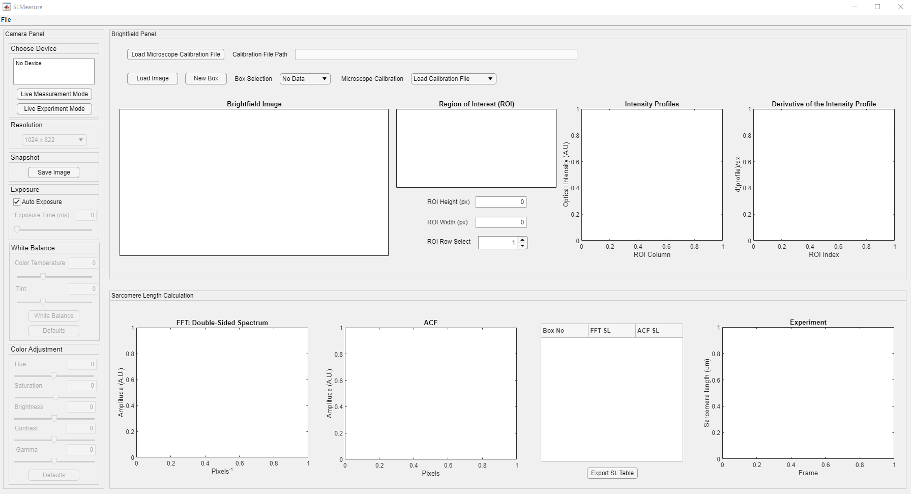
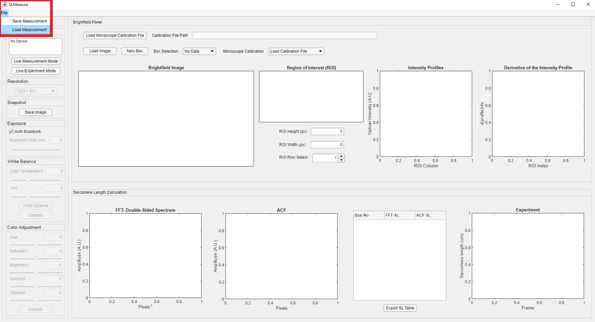
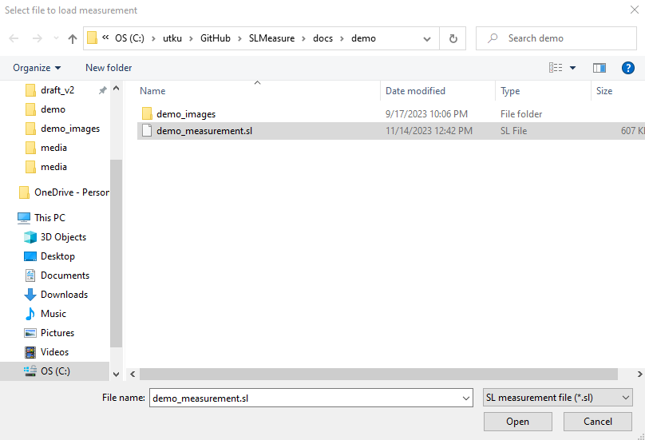

# Load analysis

This page provides simple instructions on how to load an existing measurement to SLMeasure.

## Instructions

+ Using the SLMeasure through the cloned repository
    - Launch MATLAB and double-click `SLMeasure.mlapp`. It is located under `<repo>` folder. 
    - The `SLMeasure.mlapp` file starts the MATLAB App Designer, then press <kbd>F5</kbd> to start the application.

After a few seconds, you should see a program window. This is the main SLMeasure program. (Clicking on any of the images on this page will open a larger version in a new browser window.)

Click the File button on the toolbar. The file button opens a dropdown menu, which is highlighted in the red rectangle in the image below. Click the Load Analysis button.

This button brings up a Windows File Open Dialog. Locate and load the SLMeasure measurement file. To learn how to save a SLMeasure measurement, please follow the [start new measurement tutorial](../start_new_measurement/start_new_measurement.html).

After a few seconds, the measurement is loaded to the interface. All the operations described in [start new measurement tutorial](../start_new_measurement/start_new_measurement.html) are available upon loading.

