# Start new measurement using brightfield images

This page provides simple instructions on how to perform a new sarcomere length measurement with SLMeasure using a brightfield image.

## Instructions

+ Using the SLMeasure through the cloned repository
    - Launch MATLAB and double-click `SLMeasure.mlapp`. It is located under `<repo>` folder. 
    - The `SLMeasure.mlapp` file starts the MATLAB App Designer, then press <kbd>F5</kbd> to start the application.

After a few seconds, you should see a program window. Here is the SLMeasure interface (Clicking on any of the images on this page will open a larger version in a new browser window.).

<a href="media/start_up_window.png" target="_blank">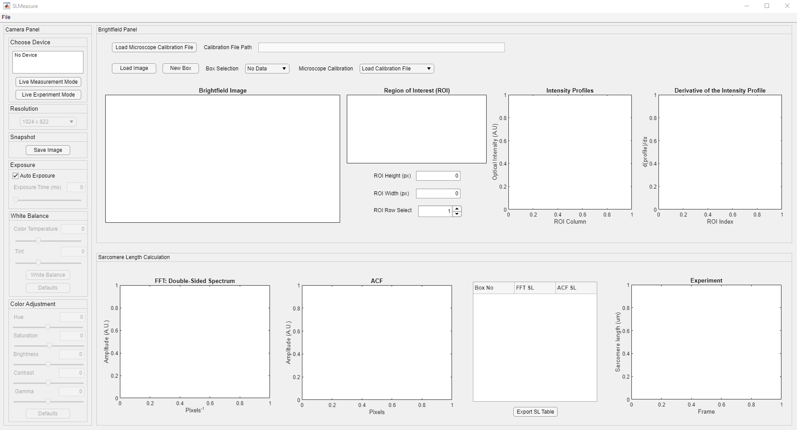</a>

The interface is divided into three different panels. Their functionality is summarized as follows:
+ Camera: This panel has all the controls for the camera used in the experiment. Its' functionality is highlighted under the "Live Measurements" tutorial.
+ Brightfield: This panel has multiple axes to show images and intensity profiles. It is the initial processing before the calculation.
    + The image axes display the brightfield images. The images are loaded using the load image button above. The region of interest (ROI) box controls are placed above the image axes. **The microscope calibration is required to convert pixels to length scales (um/px in this case).**
    + The area enclosed by the ROI is displayed on the ROI axes.
    + Intensity profiles along the height of the ROI box are displayed on the Intensity Profiles axes. The intensity profile of the selected ROI row is highlighted.
    + The derivative of the selected trace is shown on the Derivative of the Intensity profile axes. The derivation is performed to remove systemic trends.

+ Sarcomere Length Calculation: This panel shows the outputs of processing the ROI with [Fast-Fourier Transform (FFT)](https://en.wikipedia.org/wiki/Fast_Fourier_transform) and [Autocorrelation Function (ACF)](https://en.wikipedia.org/wiki/Autocorrelation). SLMeasure calculates the FFT and ACF for each row in the ROI. Once all the rows are processed, the average of the FFT amplitude spectrum is used to find the peak location. On the other hand, a damped sine function is fitted to the mean ACF.
    + The x-axis value of the first peak is highlighted (with the star marker) on the FFT axes. 
    + The R-squared and the wavelength of the damped sine function are highlighted on the ACF axes.
    + The sarcomere length value from each ROI box for each method is tabulated.
    + The Experiment axis tracks the sarcomere length measurements during the Live Experiment Mode.

The first step of the measurement with SLMeasure is to load the microscope calibration file, in an Excel, format that converts the pixels to length scales. The Load Microscope Calibration File button is located at the top left corner of the Brightfield Panel, shown in the red rectangle.

<a href="media/load_calibration_file.png" target="_blank">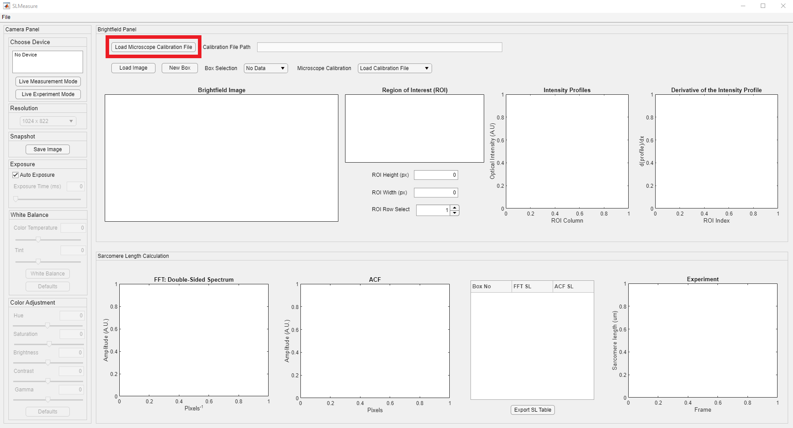</a>

Clicking the button opens a File Open Dialog. Locate the folder that has the calibration file and load it to the SLMeasure.

<a href="media/select_calibration_file.png" target="_blank">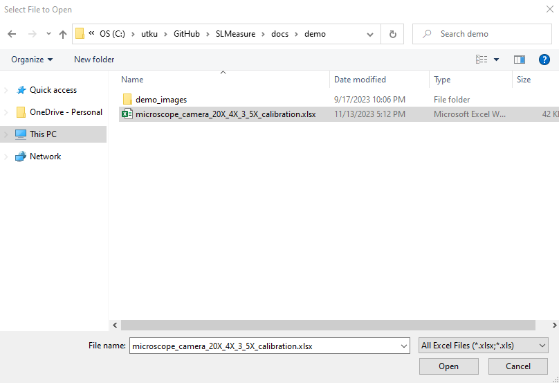</a>

SLMeasure looks for the Excel files for the calibration. The Excel file in this tutorial is formatted as follows.

<a href="media/calibration_excel_file.png" target="_blank">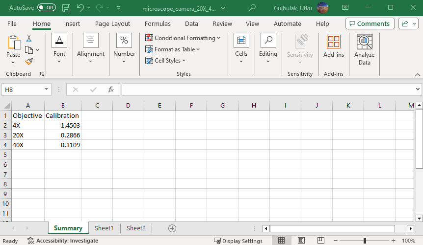</a>

Here are brief information on the sheets shown in the Excel file.

+ Summary: This sheet holds the resulting calibration constants for different objectives.
+ Sheet 1 and Sheet 2: They hold the measured distances in both length scales and pixels.

The Microscope Calibration Drop-down, shown in red rectangle, is populated with the information from the loaded calibration Excel file.

<a href="media/calibration_dropdown.png" target="_blank">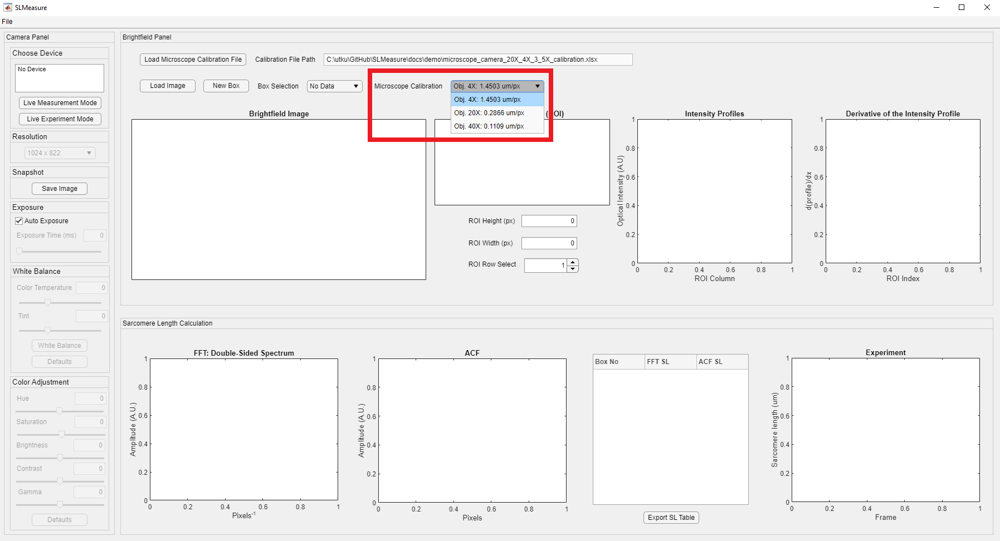</a>

The next step of the measurement with SLMeasure is to load an image file into the environment. The Load Image is located above the image axes, shown in the red rectangle.

<a href="media/load_image.png" target="_blank">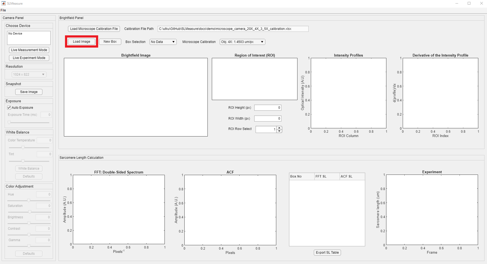</a>

Upon clicking the Load Image button, it opens a normal Windows File Open Dialog. Locate the folder that has the brightfield images on your computer. SLMeasure can work with PNG (Portable Network Graphics) and TIFF or TIF (Tag Image File Format) files.

<a href="media/file_open.png" target="_blank">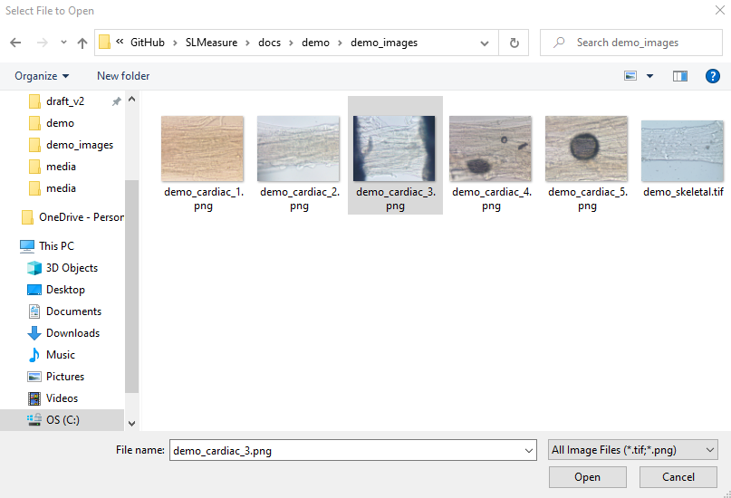</a>

An image should now be displayed in the Brightfield panel (red rectangle). The loaded image is a permeabilized preparation from the left ventricle. We expect to see a sarcomere length ranging from 1.9 - 2.3 um in this example.

<a href="media/image_loaded.png" target="_blank">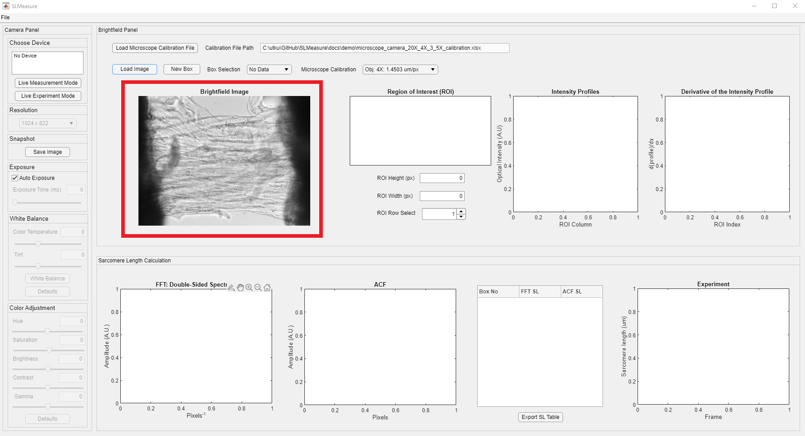</a>

You can zoom into the area of interest using MATLAB's zoom-in controls. Change the cursor mode using the zoom-in controls, shown in the red rectangle. This feature appears on the top right corner of the image axes. It is hidden, but it appears as you hover over the image

<a href="media/zoom_buttons.png" target="_blank">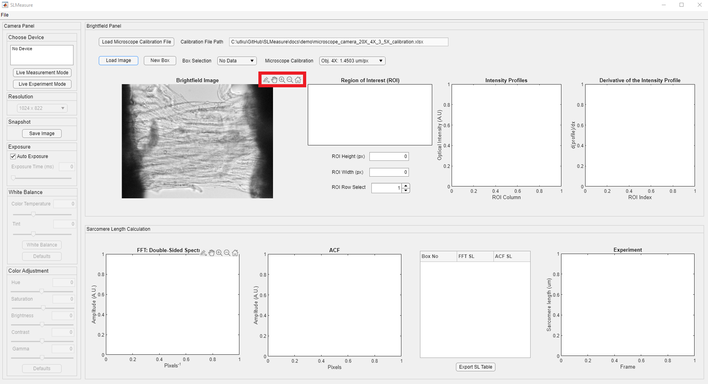</a>

Conversion from pixels to micrometers(um) is crucial for the app's functionality. The brightfield image was acquired with a 20X objective. Click the Microscope Calibration Drop-down and select the Obj. 20X option. **Please note that the microscope calibration is unique to the experimental setup. Please use your experimental setup's calibration file.**

<a href="media/microscope_calibration.png" target="_blank">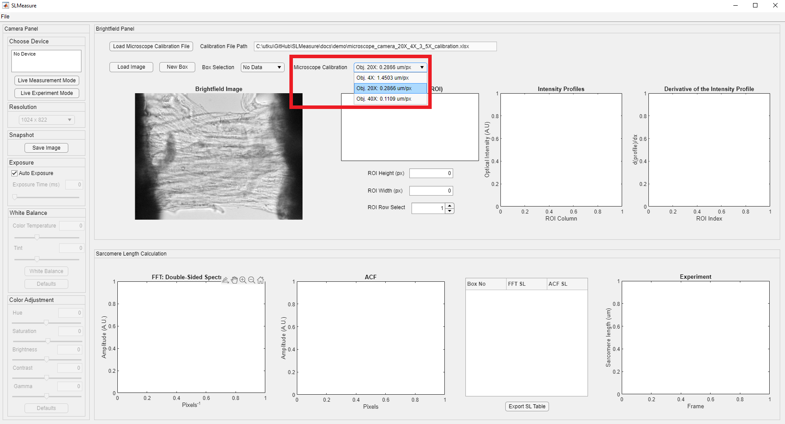</a>

The next step is to draw an ROI box for measurement. Box controls are placed above the brightfield image axes, shown in red rectangle.

<a href="media/new_box.png" target="_blank">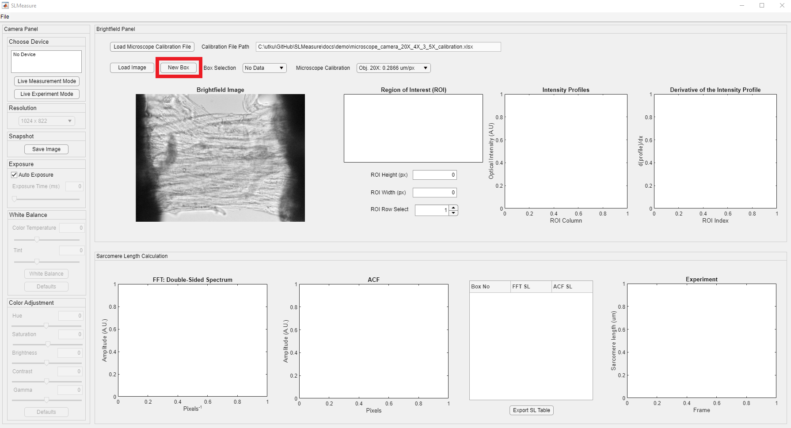</a>

After clicking the New Box button, the mouse cursor changes into a crosshair. Click on the image and expand the ROI to the desired size. You can always adjust the position of the ROI box by dragging it across the image. Make sure to place the box, where you can see "clear" striations. This is easy to accomplish using the skeletal preparation, whereas the cardiac preparations require a "closer" look. The newly generated box appears light green. 

The SLMeasure automatically processes the enclosed area in the ROI. The intensity profiles for each row in the ROI are extracted. Please note that all the empty axes and fields, except the Experiment axis, are populated now.

You can visualize the processed traces and results from all the ROI boxes using the ROI row select spinner, shown in the red rectangle. The displayed trace belongs to the 7th row in the ROI box.

<a href="media/change_row.png" target="_blank">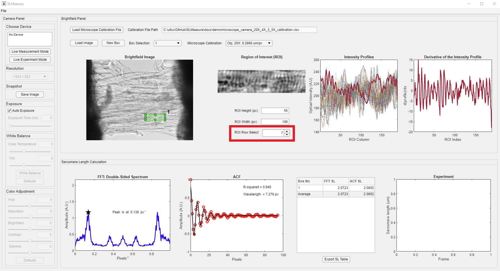</a>

Measuring multiple regions over preparation and using the average sarcomere lengths is a good practice. Once you are completed with the current box, generate your next box as mentioned above. SLMeasure will automatically place a new box near the old box. All the boxes have the same dimensions. The new box becomes the selected box (light green), and the old box is shown in red. Drag the new box to the desired position. The new box is processed, and the new values are added to the table. You can change the selected box using the Box Selection dropdown, shown in the red rectangle.

<a href="media/box_2.png" target="_blank">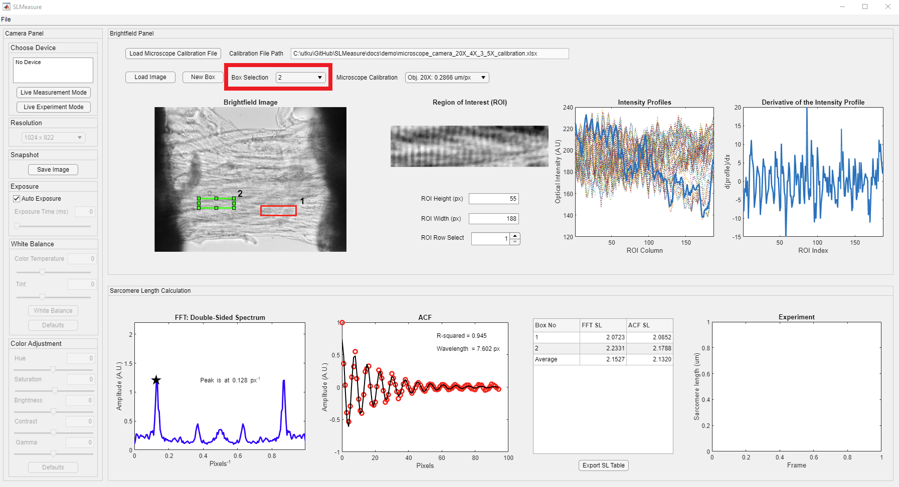</a>

Once you finish your measurement, click the File button on the toolbar (red rectangle) to save your measurement.

<a href="media/save_measurement.png" target="_blank">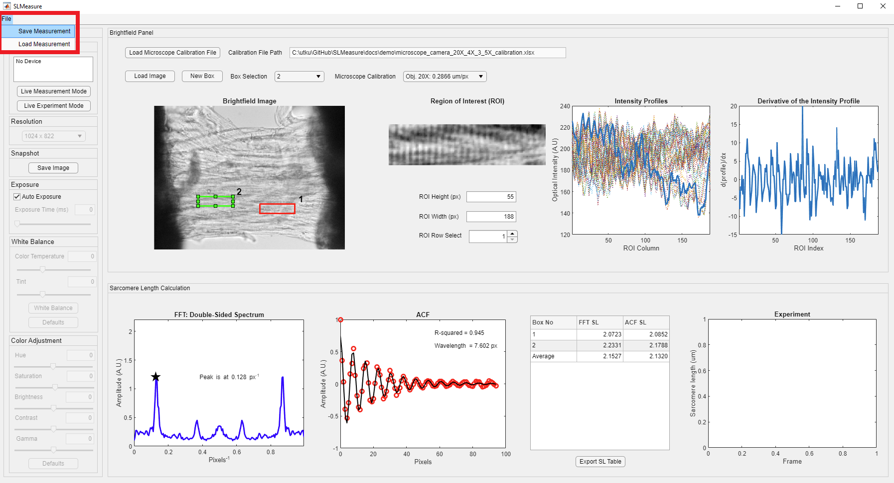</a>

The Save Measurement button opens the following file dialog box, which allows you to save SLMeasure measurement files in a unique .sl format. This file format can be loaded to SLMeasure to revisit the measurement. Name your file and click Save.

Additionally, the sarcomere length table can be exported as an Excel file. Click the Export SL Table button. 

<a href="media/export_sl_table.png" target="_blank">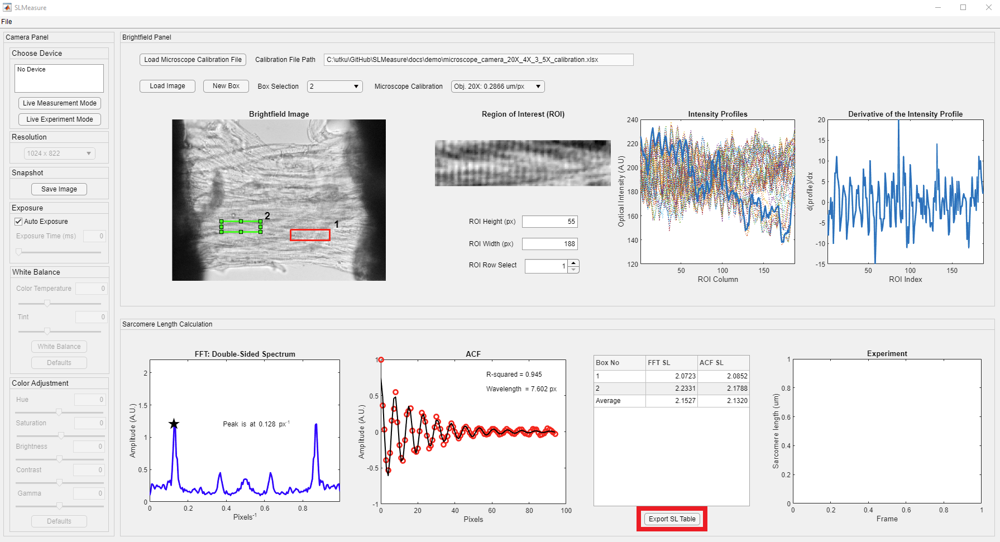</a>

The button opens a file dialog box for the Excel file. Name your file and click Save.

<a href="media/sl_table_dialog.png" target="_blank">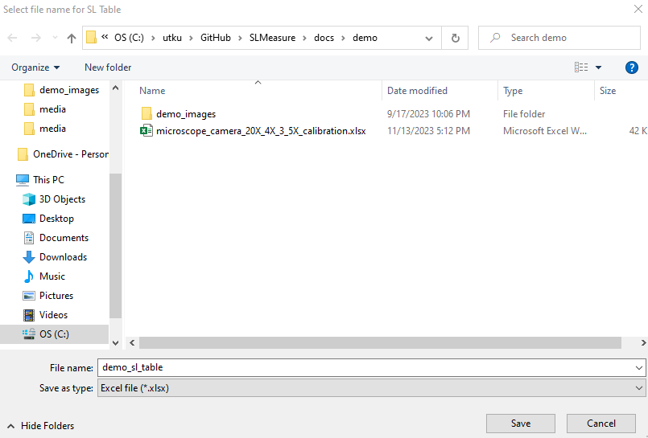</a>

The exported Excel file has the same structure as the table.

<a href="media/sl_table_excel.png" target="_blank">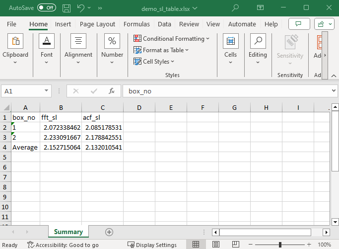</a>
